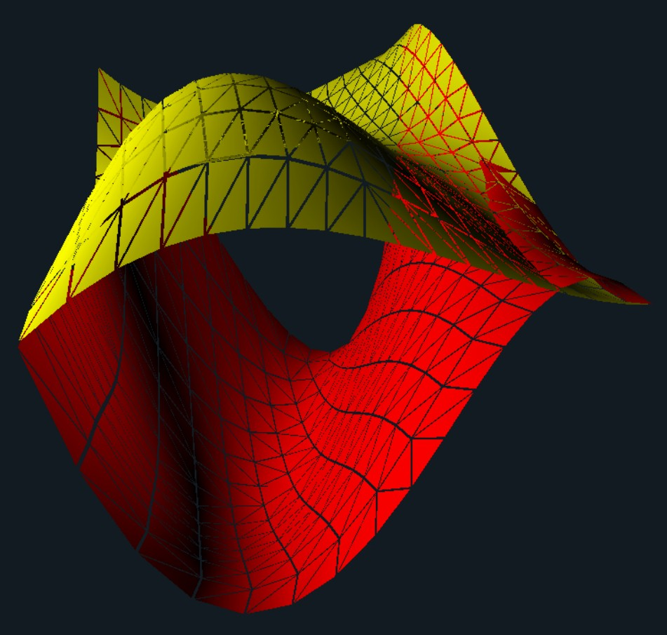
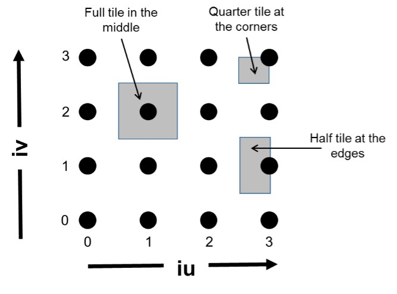

# Introduction
Bézier surfaces are a way of sculpting shapes. Because they are analytically defined, they can be computed (and rendered) to any precision you want. In this project, we are going to take these two Bézier surfaces: 
 


and use numerical techniques to find the volume between the bottom surface (red) and the top surface (yellow).  

Using some number of subdivisions in both X and Y, NUMNODESxNUMNODES, take NUMNODES2 height samples.  

We will think of each height sample as sitting on a 2D tile. That really makes that height sample act as a volume where the tile is extruded vertically from the bottom to the top.  

The tiles in the middle of the floor are full-sized tiles. Tiles along the edges are half-sized. Tiles in the corners are quarter-sized. The volume contribution of each extruded height tile needs to be weighted accordingly. The logic of this is for you to figure out.  

# Requirements
* Using OpenMP, compute the total volume betwen the two surfaces.
* Use a variety of number of subdivisions (NUMNODES). Pick at least 8 different ones.
* Use a variety of number of threads (NUMT). You must use at least 1, 2, and 4.
* Record the data in units of something that gets larger as speed increases. Joe Parallel used "MegaHeights * Computed Per Second", but you can use anything that makes sense.
* From the speed-up that you are seeing, use the "Inverse Amdahl's Law" to determine the Parallel Fraction for this application.
* From the Parallel Fraction, determine what maximum speed-up you could ever get, regardless of how many cores/threads you throw at this, even with a million cores.
* Your commentary write-up (turned in as a PDF file) should include:
    1. Tell what machine you ran this on
    2. What do you think the actual volume is?
    3. Show the performances you achieved in tables and graphs as a function of NUMNODES and NUMT
    4. What patterns are you seeing in the speeds?
    5. Why do you think it is behaving this way?
    6. What is the Parallel Fraction for this application, using the Inverse Amdahl equation?
    7. Given that Parallel Fraction, what is the maximum speed-up you could ever get?

# The Height-Evaluation Code
In this code sample, NUMNODES is the number of nodes, or dots, subdividing the floor area. So, for example, NUMNODES=4 means that there are 4 dots on each side edge.   


Each node has some amount of tile space surrounding it.  

I recommend a single for-loop over all the nodes that looks like this:   
```cpp
#pragma omp parallel for default(none)
for( int i = 0; i < NUMNODES*NUMNODES; i++ )
{
	int iu = i % NUMNODES;
	int iv = i / NUMNODES;

	. . .
}
Depending on what version of OpenMP you are using, you can also say: 

#pragma omp parallel for collapse(2) default(none)
for( int iv = 0; iv < NUMNODES; iv++ )
{
	for( int iu = 0; iu < NUMNODES; iu++ )
	{
		. . .
	}
}
```
**Note!** The above pragma lines are not complete. You need to add more to them!  

The code to evaluate the height at a given iu and iv is: 
```cpp 
#define XMIN	 0.
#define XMAX	 3.
#define YMIN	 0.
#define YMAX	 3.

#define TOPZ00  0.
#define TOPZ10  1.
#define TOPZ20  0.
#define TOPZ30  0.

#define TOPZ01   1.
#define TOPZ11  12.
#define TOPZ21   1.
#define TOPZ31   0.

#define TOPZ02  0.
#define TOPZ12  1.
#define TOPZ22  0.
#define TOPZ32  4.

#define TOPZ03  3.
#define TOPZ13  2.
#define TOPZ23  3.
#define TOPZ33  3.

#define BOTZ00  0.
#define BOTZ10  -3.
#define BOTZ20  0.
#define BOTZ30  0.

#define BOTZ01  -2.
#define BOTZ11  10.
#define BOTZ21  -2.
#define BOTZ31  0.

#define BOTZ02  0.
#define BOTZ12  -5.
#define BOTZ22  0.
#define BOTZ32  -6.

#define BOTZ03  -3.
#define BOTZ13   2.
#define BOTZ23  -8.
#define BOTZ33  -3.


float
Height( int iu, int iv )	// iu,iv = 0 .. NUMNODES-1
{
	float u = (float)iu / (float)(NUMNODES-1);
	float v = (float)iv / (float)(NUMNODES-1);

	// the basis functions:

	float bu0 = (1.-u) * (1.-u) * (1.-u);
	float bu1 = 3. * u * (1.-u) * (1.-u);
	float bu2 = 3. * u * u * (1.-u);
	float bu3 = u * u * u;

	float bv0 = (1.-v) * (1.-v) * (1.-v);
	float bv1 = 3. * v * (1.-v) * (1.-v);
	float bv2 = 3. * v * v * (1.-v);
	float bv3 = v * v * v;

	// finally, we get to compute something:


        float top =       bu0 * ( bv0*TOPZ00 + bv1*TOPZ01 + bv2*TOPZ02 + bv3*TOPZ03 )
                        + bu1 * ( bv0*TOPZ10 + bv1*TOPZ11 + bv2*TOPZ12 + bv3*TOPZ13 )
                        + bu2 * ( bv0*TOPZ20 + bv1*TOPZ21 + bv2*TOPZ22 + bv3*TOPZ23 )
                        + bu3 * ( bv0*TOPZ30 + bv1*TOPZ31 + bv2*TOPZ32 + bv3*TOPZ33 );

        float bot =       bu0 * ( bv0*BOTZ00 + bv1*BOTZ01 + bv2*BOTZ02 + bv3*BOTZ03 )
                        + bu1 * ( bv0*BOTZ10 + bv1*BOTZ11 + bv2*BOTZ12 + bv3*BOTZ13 )
                        + bu2 * ( bv0*BOTZ20 + bv1*BOTZ21 + bv2*BOTZ22 + bv3*BOTZ23 )
                        + bu3 * ( bv0*BOTZ30 + bv1*BOTZ31 + bv2*BOTZ32 + bv3*BOTZ33 );

        return top - bot;	// if the bottom surface sticks out above the top surface
				// then that contribution to the overall volume is negative
```
# The main Program
Your main program would then look something like this:  

```cpp
float Height( int, int );

int main( int argc, char *argv[ ] )
{
	. . .

	// the area of a single full-sized tile:

	float fullTileArea = (  ( ( XMAX - XMIN )/(float)(NUMNODES-1) )  *
				( ( YMAX - YMIN )/(float)(NUMNODES-1) )  );

	// sum up the weighted heights into the variable "volume"
	// using an OpenMP for loop and a reduction:

	?????
}
```